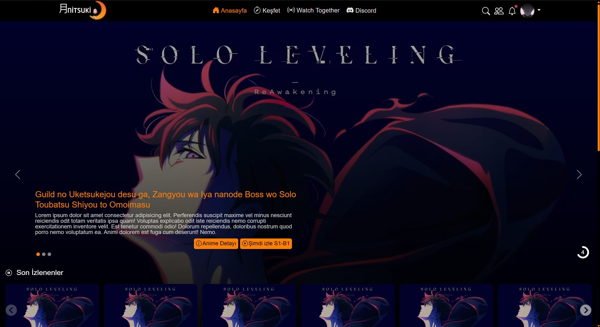
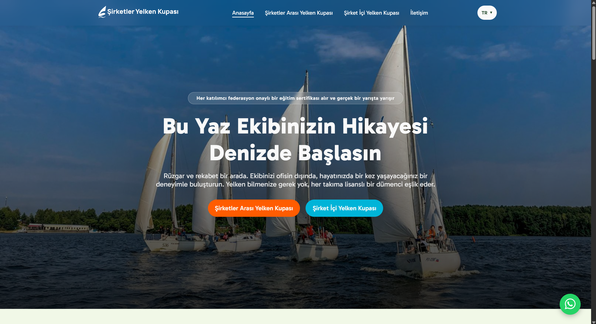

# Hi there! I'm Furkan 🚀

A **Fullstack Developer** who combines strong, scalable **ASP.NET Core** backend architectures with dynamic, modern **React** frontend experiences. From design to deployment, I focus on producing clean code, high-performance database management, and user-focused solutions across the entire process.

---

### 🚀 What I'm Into
* 🏗️ **Enterprise Backend:** Building secure, scalable, and high-performance APIs and microservice architectures with ASP.NET Core.
* ⚛️ **Dynamic Frontend:** Building React-based, highly usable, responsive, and modern single-page applications (SPAs).
* 💾 **Database Management:** Writing optimized data models, relational database designs, and performant queries with SQL.
* ⚡ **CI/CD & Deployment:** Shipping the projects I build to production quickly and seamlessly with Vercel and modern cloud tools.

---

### 🛠️ Technologies & Tools

| Area | Technologies |
| :--- | :--- |
| **Frontend** | React, JavaScript (ES6+), HTML5, CSS3, SCSS, Tailwind CSS, Bootstrap |
| **Backend & Database** | ASP.NET Core, C#, SQL Server / Relational Databases |
| **Tools & Deployment** | Git, GitHub, Framer, Vercel |

---

### 📂 Featured Projects

<table>
  <tr>
    <td width="50%" valign="top">
      <h4>🌐 Anitsuki (Anime Platform)</h4>
      
      
A modern, responsive web platform interface built with HTML, CSS, and SCSS, designed for anime fans.

      

        <a href="https://github.com/frkngl/AnitsukiFE-v2.0" target="_blank">📁 Repo Link</a> │ 
        <a href="https://frkngl.github.io/AnitsukiFE-v2.0/" target="_blank">🔗 Live Demo</a>
      

    </td>
    <td width="50%" valign="top">
      <h4>⛵ Şirketler Yelken Kupası (Corporate Sailing Cup)</h4>
      
      
An SEO-optimized corporate website built with HTML, CSS, Bootstrap, and form integrations for a corporate sailing event.

      

        <a href="https://github.com/frkngl/Yelken-Kupasi-Website" target="_blank">📁 Repo Link</a> │ 
        <a href="https://www.yelkenkupasi.com/" target="_blank">🔗 Live Demo</a>
      

    </td>
  </tr>
</table>

---

### 📊 Stats & Contact

<table>
  <tr>
    <td width="60%" valign="top">
      <h4>📊 My GitHub Coding Streak</h4>
      

        
      

      <h4>📫 Get in Touch</h4>
      

        &nbsp;&nbsp;&nbsp;&nbsp;
        &nbsp;&nbsp;&nbsp;&nbsp;
        
      

    </td>
    <td width="40%" valign="center" align="center">
      <h4>領域展開 (Domain Expansion) 🤞</h4>
      
       
      <i>"Go beyond!"</i>
    </td>
  </tr>
</table>

---

⚡ *Always Dark Mode, for eye health and focus!*
